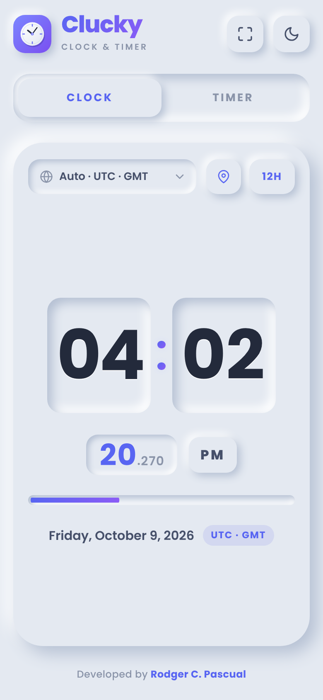

# Clucky

A clean, neumorphic **world clock & countdown timer** that installs on your phone like a native app.

## Features

- **Big, bold time.** Huge digits that scale to fill any screen, with a seconds progress bar and a blinking colon.
- **Focus mode** (⛶ button, `F`, or double-click the clock): hides everything but the time, goes fullscreen, and keeps the screen awake. Works as a desk or bedside clock.
- **Your real time zone, automatically.** The clock follows your device's time zone, including daylight saving, and updates if your phone changes zones while you travel.
- **📍 Detect from location:** tap the pin to set the time zone from your GPS position. The lookup runs on the device, so no location data is sent anywhere.
- **World clock** with 16 more time zones, a 12/24-hour toggle, and the date with the zone name and GMT offset.
- **Countdown timer:**
  - *Duration* mode with quick presets (1m to 1h), plus pause, resume, and +1 minute.
  - *Target time* mode counts down to a date and time in any time zone.
  - Hours, minutes and seconds each in their own tile, with milliseconds below and a progress bar that drains as time runs out. Everything turns amber in the last 10 seconds.
  - When the timer ends, an alarm beeps and the phone vibrates.
  - The timer keeps running if you close the app.
- **Light and dark themes.** Follows your system setting by default; tap the moon or sun to switch.
- **Fits every screen:** phones (portrait and landscape), tablets, and desktops. Tested on iPhone 15 Pro Max, Pixel 9 Pro XL, and Oppo Pad 3 screen sizes.
- **Installable PWA** that works offline after the first visit.
- **Keyboard shortcuts:** `C` for Clock, `T` for Timer, `Space` to start or pause, `F` for focus, `Esc` to exit focus.

## Install on your phone

- **Android (Chrome/Edge):** open the site and tap the ⬇ install button in the header, or use *⋮ → Install app*.
- **iPhone/iPad (Safari):** tap **Share** and then **Add to Home Screen**. Clucky shows this hint on your first visit.

## Deploy to GitHub Pages

1. Push this repository to GitHub.
2. Go to **Settings → Pages**.
3. Under **Build and deployment**, choose **Deploy from a branch**, then pick your branch and the `/ (root)` folder.
4. After about a minute the app is live at `https://<your-username>.github.io/Clucky/`.

All paths are relative, so it works from a project subpath without any configuration. `.nojekyll` makes Pages serve the files as they are.

### Shipping updates

The service worker caches the app for offline use. When you change any file, **bump `VERSION` in `sw.js`** (for example `clucky-v1` → `clucky-v2`). Installed apps pick up the new version on their next launch.

## Files

| File | Purpose |
| --- | --- |
| `index.html` | Markup |
| `styles.css` | Neumorphic design, light/dark themes, responsive and landscape layouts |
| `app.js` | Clock, timer, time zones, alarm, focus mode, install prompt |
| `manifest.webmanifest` | PWA metadata (name, icons, screenshots, shortcuts) |
| `sw.js` | Service worker for offline support |
| `icons/` | App icons (SVG sources and generated PNGs) |
| `vendor/tz-lookup.js` | Offline coordinates → time zone lookup ([@photostructure/tz-lookup](https://github.com/photostructure/tz-lookup), CC0) |
| `screenshots/` | Screenshots used by the install dialog |
